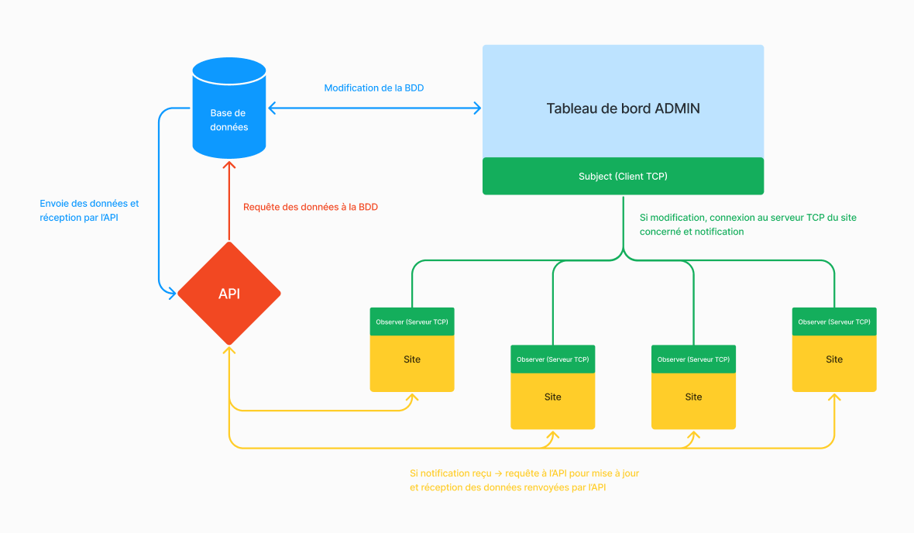

# Projet Dev B2 - Tableau de bord administrateur centralisé

## A propos

### Le projet

Ce projet consiste en un tableau de bord administrateur permettant de gérer le contenu de sites web, pour l'instant de sites vitrines.  
L'idée étant que comme chaque site se trouve sur un serveur différent de celui du tableau de bord cela puisse permettre au tableau de bord de gérer plusieurs sites et éviter d'avoir sur chaque serveur, un tableau de bord associé au site.  
Ainsi, tout est centralisé autour de cet unique tableau de bord.
Il y a un système de gestion d'utilisateurs servant à authentifier et autoriser les différents accès du site.

### Infrastructure et explications



Le tableau de bord administrateur contrôle le contenu des sites. Il permet d'ajouter, de modifier, de supprimer ou de visualiser les différents textes mais aussi d'ajouter ou de supprimer les images du site. Seul un utilisateur possédant un compte, s'étant identifié et ayant les droits d'administration du site peuvent effectuer les opérations précédentes.  
Le tableau de bord communique avec la base de données, permettant de mettre à jour les données des sites.
Les sites vitrines n'ont pas un accès direct à la base de données, ils doivent passer par une API afin d'obtenir les textes associés.
Lors d'une action lié à un texte, le TDB (tableau de bord) envoie une requête à la BDD (base de données) puis le site requête automatiquement l'API en cas de modification, cette dernière récupère les textes et les renvoie au site afin de les afficher.  
Lors d'une action lié à une image, le TDB envoie une requête à la BDD puis le TDB envoie l'image en format base64 à l'API qui s'occupe de stocker l'image, une fois l'action réussie, le TDB se connecte au serveur TCP du site concerné et envoie un message avec l'action (chiffre entre 0 pour ajout et 1 pour suppression d'image), l'identifiant de l'image et l'identifiant du site. Le serveur TCP requête ainsi l'API et télécharge l'image sur le serveur du site. L'image est ensuite retrouvée et affichée sur la page dans la section adéquate.

### Technologies

Tableau de bord administrateur :
- [TypeScript](https://www.typescriptlang.org/) : Langage de programmation permettant le typage basé sur JavaScript
- [Nest.js](https://nestjs.com/) : Framework Node.js basé sur TypeScript, conçu pour développer des applications serveur robustes et évolutives en utilisant des concepts orientés vers les objets, la programmation fonctionnelle et le design pattern MVC (Modèle-Vue-Controlleur)
- [TypeORM](https://typeorm.io/) : ORM (Object-Relational Mapping) TypeScript/JavaScript facilitant l'interaction avec des bases de données relationnelles

API :
- [Python](https://www.python.org/) : Langage de programmation interprété, polyvalent, orienté objet et à typage dynamique, privilégiant la lisibilité du code et la simplicité.
- [Flask](https://flask.palletsprojects.com/en/3.0.x/) : Micro framework open-source de développement web en Python, utilisé pour faire une API

Base de données :
- [Mariadb](https://mariadb.org/) : Système de gestion de base de données relationnelle open source, dérivé de MySQL, conçu pour offrir des performances élevées, la fiabilité et la compatibilité avec MySQL

Sites vitrines :
- [Next.js](https://nextjs.org/) : Framework React utilisé pour créer des applications web avec rendu côté serveur (SSR) et génération statique, incluant le routage et d'autres fonctionnalités prêtes à l'emploi

Serveurs TCP :
- [Python](https://www.python.org/) : Langage de programmation interprété, polyvalent, orienté objet et à typage dynamique, privilégiant la lisibilité du code et la simplicité.
- [Librairie Socket](https://docs.python.org/3/library/socket.html) : Librairie native permettant la création et la gestion de connexions réseau bas niveau en utilisant des sockets, utilisée pour créer et gérer un serveur TCP attendant une connexion client pour recevoir une notification 

Déploiement et conteneurisation :
- [Docker](https://www.docker.com/) : Plateforme de virtualisation légère permettant de créer, déployer et exécuter des applications dans des conteneurs logiciels

### L'équipe
- Axel BROQUAIRE
- Hugo ANDRIAMAMPIANINA
- Joris PELLIER

## Installation

Créer un fichier .env à la racine du projet et copier coller le contenu ci-dessous à l'intérieur du fichier  
**Pensez à ajouter votre propre `Secret Key`**
```bash
SESSION_SECRET=<your-secret-key>
SESSION_MAX_AGE=10800000
SESSION_RESAVE=false
SESSION_SAVE_UNINITIALIZED=false
DATABASE_HOST='db'
DATABASE_PORT=3306
DATABASE_USERNAME='maria-woman'
DATABASE_PASSWORD='Q_ml8G80x]Gborqb!Z$m.8@pg7$O'
DATABASE_ROOT_PASSWORD='V@ixoqTVfSLn[Q+Oe#owF~2vaUJx'
DATABASE_NAME='db_projet_dev'
```

## Démarrage de l'application

```bash
# Démarre le back-end (Tableau de bord admin, API et base de données) avec docker compose
$ docker compose -f .\docker-compose-dev-linux.yml up -d --build
```

```bash
# Démarre le site 1 (site et serveur tcp dans un seul conteneur) avec docker compose
$ docker compose -f .\docker-compose-site1.yml up -d --build
```

```bash
# Démarre le site 2 (site et serveur tcp dans un seul conteneur) avec docker compose
$ docker compose -f .\docker-compose-site2.yml up -d --build
```

```bash
# stop docker containers one by one
$ docker compose -f .\docker-compose-dev-linux.yml down
$ docker compose -f .\docker-compose-site1.yml down
$ docker compose -f .\docker-compose-site2.yml down

# stop docker containers all
$ docker compose -f .\docker-compose-site1.yml down --remove-orphans
```

## Liens utiles

- [Tableau de bord Administrateur](http://localhost:3000)  
- [Site vitrine 1](http://localhost:8001)  
- [Site vitrine 2](http://localhost:8002)  

## Identifiants de connexion Administrateur

```
email: admin@admin
password: 8ook5E@qgmA>~Q1wP7s_
```